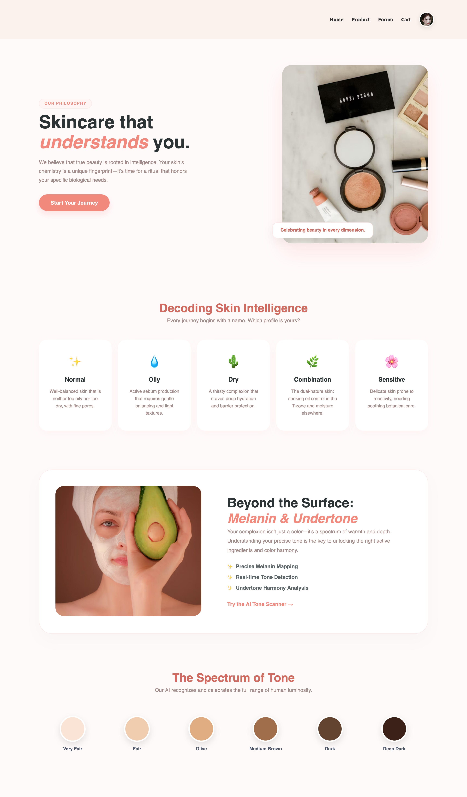

# GlowUp
### Skin Care Product Recommendation System

## Project Overview
This project is a **Skin Care Product Recommendation System** designed to help users find the most suitable skin care products based on their skin type. The system not only recommends products using AI but also provides a mini **e-commerce platform** where users can add products to the cart and make purchases.  

The application combines **personalized recommendations** with an intuitive shopping experience to simplify skincare selection.

---

## Features
- **Skin Type Based Recommendations:** Users input their skin type, and AI recommends suitable products.  
- **E-commerce Functionality:** Users can browse products, add them to the cart, and proceed to checkout.  
- **Product Listings:** Detailed product information including ingredients, usage instructions, and skin type suitability.  
- **AI Integration:** Machine learning component analyzes user input to provide personalized recommendations.  
- **Responsive Frontend:** Interactive and user-friendly interface.  

## 🧠 How the AI Works

### 1. The Vision Engine: Skin Tone Detection
The system follows a rigorous pipeline to ensure accuracy regardless of lighting conditions.

* **Face Landmarking:** Uses a pre-trained **MediaPipe** model to identify facial coordinates, cropping out hair and background.
* **Histogram-Based Thresholding:** Employs **Otsu’s Binarization** to calculate a "Sweet Spot" brightness threshold, isolating skin from shadows.
* **Color Space Conversion:** Converts BGR images to **YCrCb** and **HSV**. YCrCb is used specifically to separate brightness ($Y$) from color ($Cr/Cb$), ensuring robustness against lighting shifts.
* **K-Means Clustering:** Pixels are treated as data points in a 4D space ($Y, H, Cr, Cb$). K-Means groups these into clusters, selecting the dominant center to represent the skin tone.
* **Classification:** Final values are processed by a **RandomForestClassifier** to map the data to 6 categories: *Very Fair, Fair, Medium, Olive, Brown, or Dark.*

### 2. The Logic Engine: Recommendation System
Once the user profile is established, the system suggests products using Vector Mathematics.

* **One-Hot Encoding:** User skin concerns and product attributes are converted into binary vectors.
* **Cosine Similarity:** The system calculates the mathematical "angle" between the User Vector ($\mathbf{A}$) and the Product Vector ($\mathbf{B}$):

$$similarity = \cos(\theta) = \frac{\mathbf{A} \cdot \mathbf{B}}{\|\mathbf{A}\| \|\mathbf{B}\|}$$

---

## 🖼️ Project Gallery

<table style="width:100%; border-collapse: collapse;">
  <tr>
    <td width="50%" align="center">
      <strong> AI Facial Scan</strong> 
      
    </td>
 <td width="50%" align="center">
      <strong>User skin detail form</strong> 
      
    </td>
 <td width="50%" align="center">
      <strong>User Profile Page</strong> 
      
    </td>
 <td width="50%" align="center">
      <strong>Product page</strong> 
      
    </td>
    </td>
 <td width="50%" align="center">
      <strong>Product Detail page</strong> 
      
    </td>
 <td width="50%" align="center">
      <strong>Home Page</strong> 
      
    </td>
    <td width="50%" align="center">
      <strong>Discussion Forum</strong> 
      
    </td>
  </tr>
  <tr>
    <td width="50%" align="center">
      <strong> Cart Page</strong> 
      
    </td>
    <td width="50%" align="center">
      <strong>About Page</strong> 
      
    </td>
    <td width="50%" align="center">
      <strong>Contact form</strong> 
      
    </td>
    <td width="50%" align="center">
      <strong>Feedback Form</strong> 
      
    </td>
    <td width="50%" align="center">
      <strong>Create Post</strong> 
      
    </td>
   
  </tr>
</table>

---

## Tools & Technologies
**Frontend:**  
- HTML, CSS, JavaScript  
- React.js  

**Backend:**  
- Django  

**AI/ML:**  
- Machine learning model product recommendations  

**Database:**  
- SQLite 

## Installation & Setup

**Note: Create Virtual Environment**

**Frontend:**  
cd frontend
npm install
npm run dev

**Backend:**  
cd backend
pip install -r requirements.txt
python manage.py migrate
python manage.py runserver

